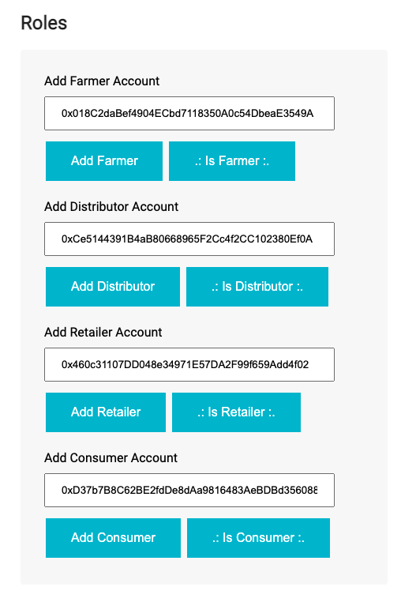
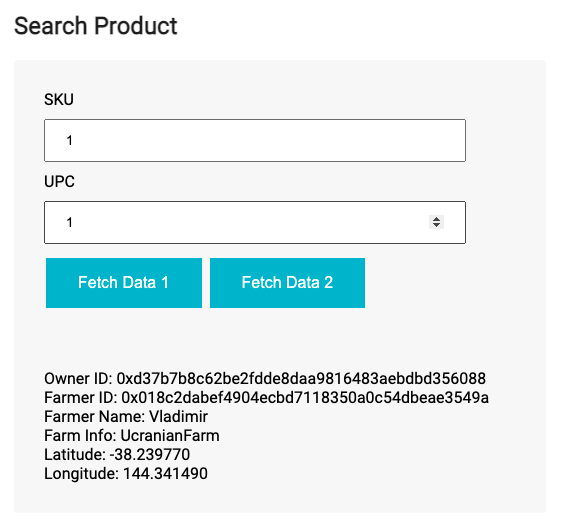
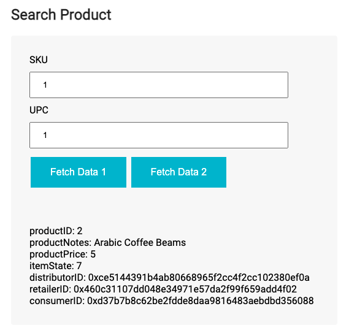
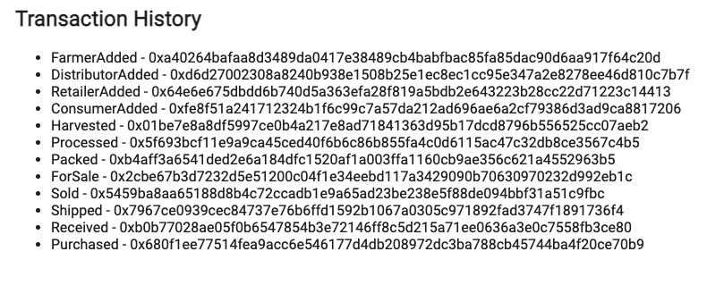
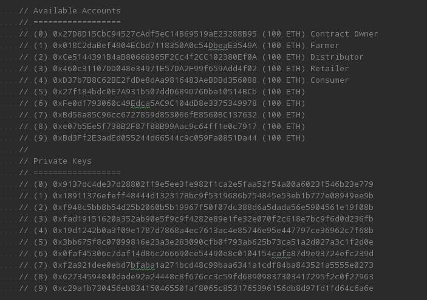
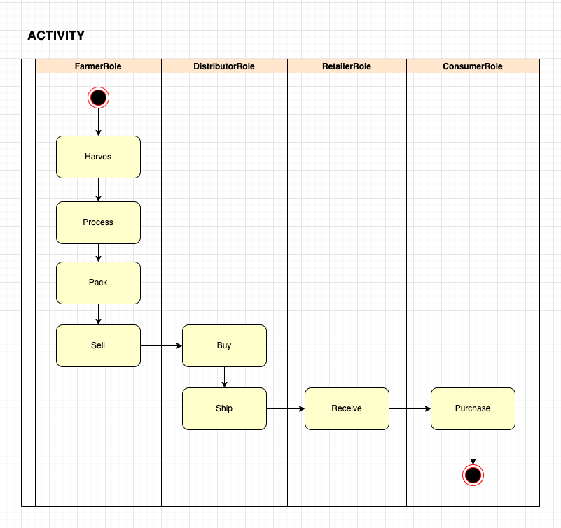
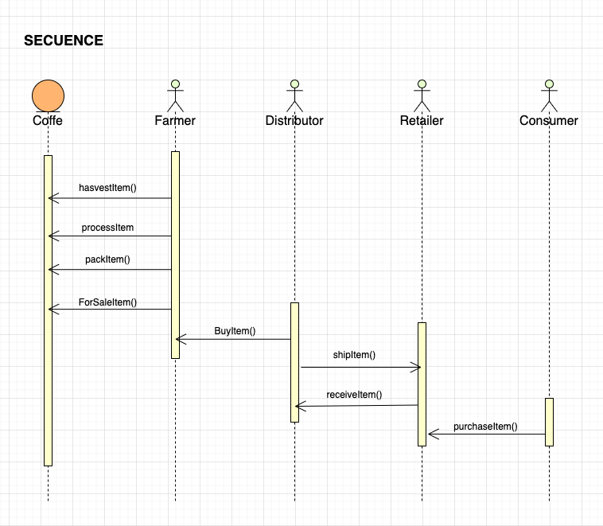
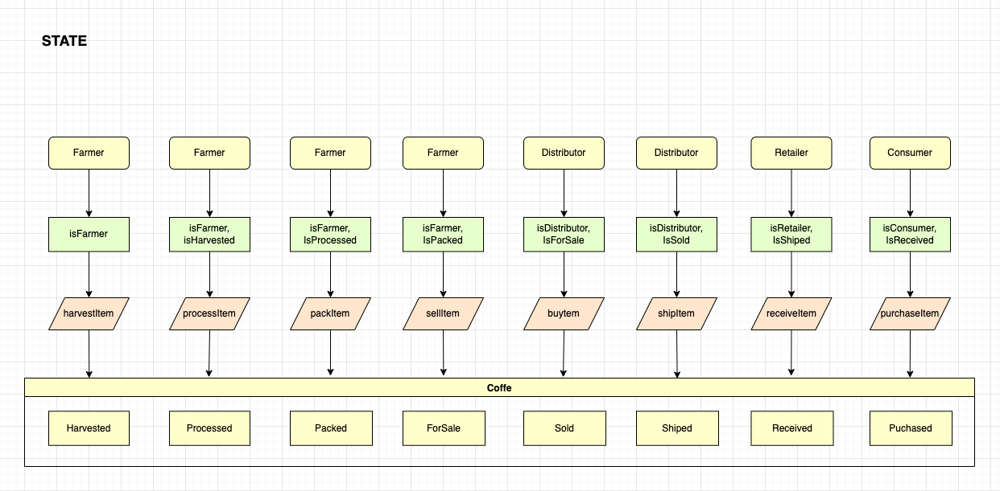
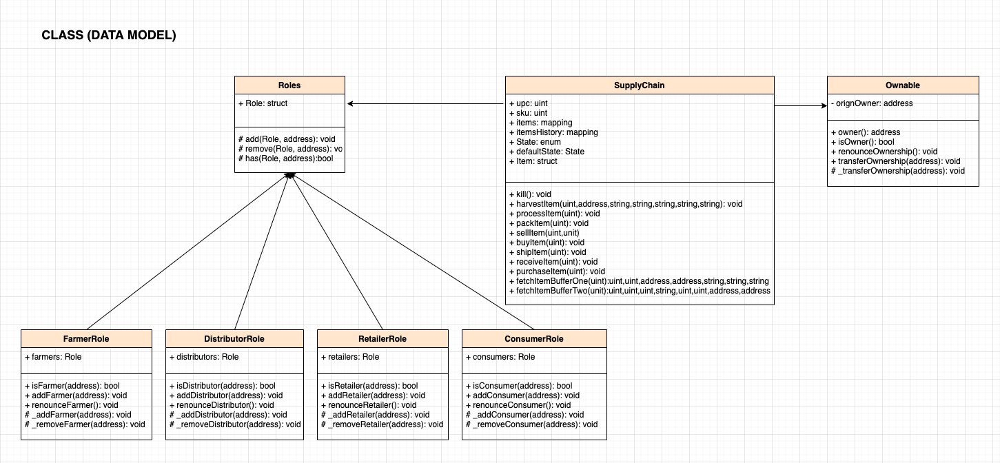

## Rinkeby Project Deployment
The deployments has been done from the Wallet Address:
	https://rinkeby.etherscan.io/address/0xd88595bcb6518ea2c7ac0459677fd237acf31b76

The Smart Contract has been deployed with address:
	https://rinkeby.etherscan.io/address/0xb57817d8c6a318cb66ba4b70e8a5a5d1c8a11383

The deploy stack is the next:

	truffle migrate --reset --network rinkeby

	Using network 'rinkeby'.

	Running migration: 1_initial_migration.js
	  Replacing Migrations...
	  ... 0xbb19c7ae195c2e9da61722d8fe9c5e60b4e241f6956aeeb79a5f66c08f0b506d
	  Migrations: 0xda0a855de5d4ff218c864b4a77fcc7e6b6d21bbb
	Saving successful migration to network...
	  ... 0x2b2a433d0b18b5546ba20873be937ab54889f186d5de684e66fdb4ab71ebc06e
	Saving artifacts...

	Running migration: 2_deploy_contracts.js
	  Deploying SupplyChain...
	  ... 0x5533b0245d37dc5d4b679900f065f3a5bfebe3701f4e7a7fc4922026c7ad81ad
	  SupplyChain: 0xb57817d8c6a318cb66ba4b70e8a5a5d1c8a11383
	Saving successful migration to network...
	  ... 0x7b2e7768038a3e5efe2b58dca6d962f49f9ba9b9d901d194407ad13c2784bd9a
	Saving artifacts...

## Project
The DApp has been reimplemented adding support to add Farmeres, Distributors, Retailers and Consumers

You must set the role account in Metamask to launch the role actions
All actions has been implemented to use only with a specific role:

Farmer:
* Harvest
* Process
* Pack
* For Sale

Distributor:
* Buy
* Ship

Retailer
* Receive

Consumer
* Purchase

There are 2 buttons to show the Product Info: Fetch Data 1 and Fetch Data 2

An Example to Transaction History done from local blockchain is the next:

## Used Accounts

## UML diagrams 

## Versioned:

* Truffle v4.1.14 (core: 4.1.14)
* Solidity v0.4.24 (solc-js)
* Ganache CLI v6.12.2 (ganache-core: 2.13.2)
* Node v16.13.2
* npm 8.4.1
* npm view web3 version 1.7.0

## Repository
* https://github.com/ferchyno/nd1309-Project-6b-Example-Template.git